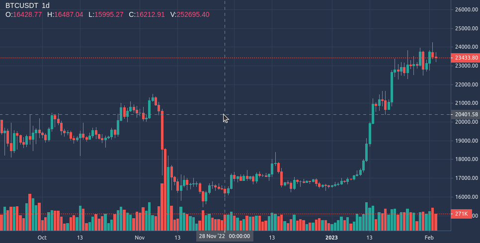

# Trading View Lighweight Charts embedded in Go

React app with [TradingView Lightweight Charts](https://github.com/tradingview/lightweight-charts) embedded in a Go server

``` bash
# install dependencies
npm --prefix charts/trading-view-react/ install

# build react
npm --prefix charts/trading-view-react/ run build

# run go server server build folder inside charts/trading-view-react/build
go run cmd/main.go
# server will be running on http://localhost:9901

# it grabs BTCUSDT 1h candlestick data from Binance
# react app make srequest to http://localhost:9901/data and renders the chart
```
[](./tradingviewcharts-go2.png)
